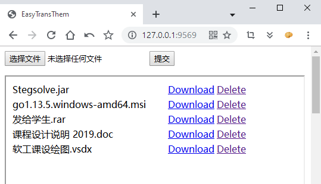
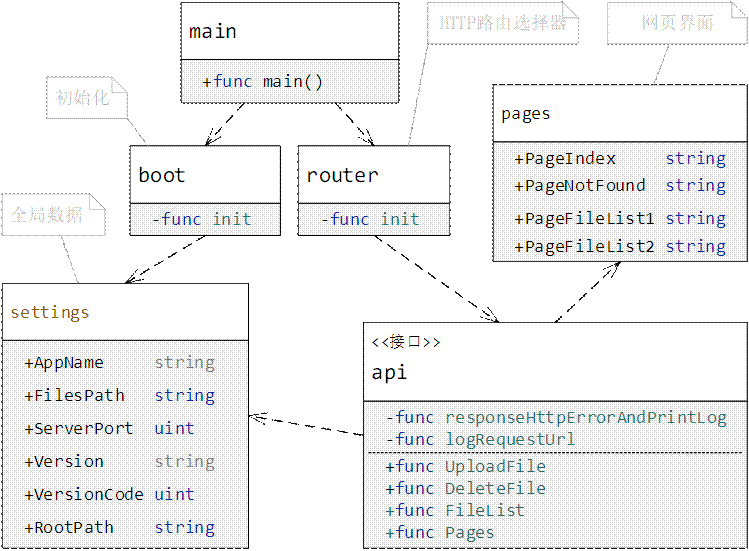

## EasyTransThem

EasyTransThem是一个基于GO的跨平台文件服务器（类网盘），适用于个人文件的临时传输和存储。

警告：未作任何安全检查，存在目录穿越等各类漏洞，请小心使用！

注意：`pages/pageIndex.go`中jQuery使用的是互联网资源，如果应用在无互联网环境下请将其替换为静态内容。

##### 演示

```
Usage:
  -h    Show this help.
  -p    Server port for listening. (default 9569)
  -v    Show version information.
```

```
用法：
  -h    显示帮助
  -p    端口号（默认9569）
  -v    显示版本信息
```

主界面：



上传进度条：


##### 类图




TODO（应该并不会做）:

- [ ] 完成readme
- [x] ~~框架设计~~
- [x] ~~文件上传~~
- [ ] 大文件优化
- [x] ~~上传进度条~~
- [x] ~~文件删除~~
- [ ] 文件信息显示
- [ ] 界面美化
- [ ] 密码保护
- [ ] 内容全自动同步
- [ ] 客户端
